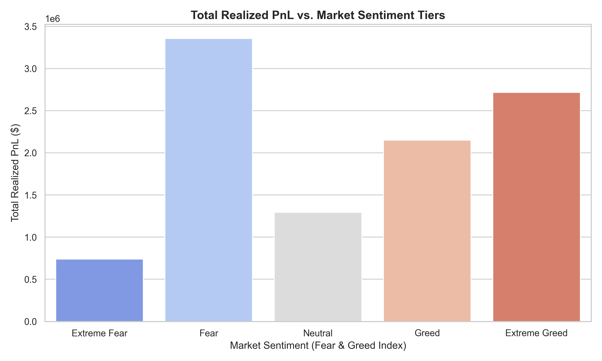
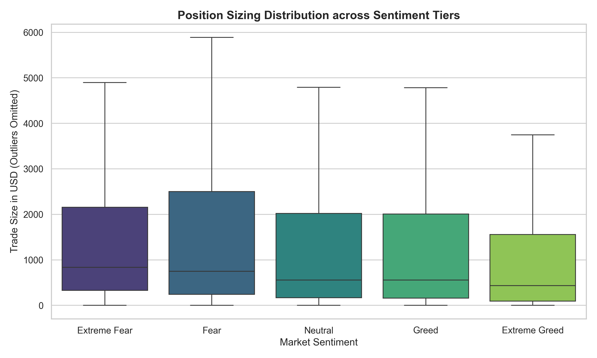

# Quantitative Analysis: Trader Performance & Market Sentiment on Hyperliquid

## 📌 Project Overview
This repository contains a quantitative analysis exploring the relationship between market psychology (Bitcoin Fear & Greed Index) and actual trader execution metrics (historical trade data from Hyperliquid). 

The goal of this study is to determine if market sentiment correlates with trader performance, risk appetite, and position sizing behaviors.

## 🚀 Key Insights & Strategy Alpha
1. **Strategic Risk Reduction during FOMO:** Counter-intuitively, as market sentiment moves into **Extreme Greed**, traders significantly *decrease* their median position sizes (the lowest across all tiers). This disciplined risk mitigation rewards them with a peak win rate of **89.1%** and a high average PnL per trade ($130.20).
2. **Aggressive Dip-Buying in Fear:** Traders deploy their largest position sizes during periods of **Fear** (approaching a \$6,000 upper quartile fence). This aggressive positioning captures massive absolute profits (over \$3.3M total realized PnL), proving that Hyperliquid traders successfully capitalize on retail panic.
3. **The Extreme Fear Capitulation:** When sentiment shifts to **Extreme Fear**, performance degrades significantly. The win rate drops to its lowest level (**76.2%**), and average PnL falls to **\$71.02**, indicating that stop-losses and liquidations dominate during severe market capitulations.

## 📊 Visualizations
### 1. Total Profitability Matrix

*Traders generate peak absolute returns during market 'Fear' and 'Extreme Greed'.*

### 2. Risk Allocation and Position Sizing

*Box plot demonstrating significant position scaling during 'Fear' and tight risk containment during 'Extreme Greed'.*

## 🛠️ Setup and Execution
1. Clone the repository.
2. Install dependencies: `pip install -r requirements.txt`
3. Place raw datasets into a `data/` directory.
4. Run the data pipeline notebook or script to reproduce the analytics.